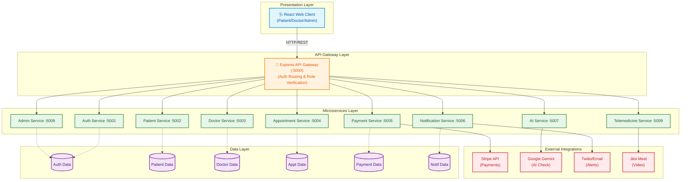

# Architecture Diagram for SE-128 Smart Healthcare Platform

Please copy the code block below and paste it into the [Mermaid Live Editor](https://mermaid.live).
From there, you can easily tweak colors and click **"Save as PNG"** or **"Save as SVG"** to include in your PDF report!

