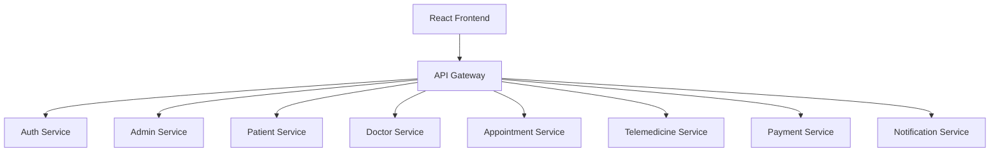

# 🏥 AI-Enabled Smart Healthcare Appointment & Telemedicine Platform

A modern, scalable microservices-based healthcare platform designed for seamless patient-doctor interactions, medical record management, and secure telemedicine consultations.

## 🚀 Project Overview
This project uses a **Distributed Microservices Architecture** to ensure high availability and independent scaling of different healthcare domains.

*   **Frontend**: React (Vite) with a premium dark-themed UI.
*   **API Gateway**: Central entry point for all frontend requests, handling security and routing.
*   **Database**: MongoDB (Shared/Service-specific databases).
*   **Communication**: Rest API with JSON.

---

## 🏗️ System Architecture


---

## 👥 Team Distribution & Status

### 🏆 Member 1 (COMPLETED)
**Responsibility**: Core Architecture, Auth, Gateway, User/Admin Management.
*   [x] Full Registration/Login (JWT + Bcrypt).
*   [x] API Gateway routing for all services.
*   [x] Admin Dashboard (User removal, Doctor verification).
*   [x] UI/UX Overhaul with premium dark theme.

### 👤 Member 2 (UPCOMING)
**Responsibility**: Patient Domain & File Handling.
*   [ ] Patient Profile Management.
*   [ ] Medical Report Uploads (PDF/Images) using `multer`.
*   [ ] View Medical History & Prescriptions.

### 🩺 Member 3 (UPCOMING)
**Responsibility**: Doctor Domain & Telemedicine.
*   [ ] Manage Doctor Profiles & Availability.
*   [ ] Appointment Scheduling & Booking Logic.
*   [ ] Video Consultation Integration.

### 💰 Member 4 (UPCOMING)
**Responsibility**: Payments, Notifications & AI.
*   [ ] Payment Gateway Integration.
*   [ ] Email/SMS Notifications.
*   [ ] AI Symptom Checker.

---

## 🛠️ Installation & Setup

### Prerequisites
*   Node.js (v18+)
*   MongoDB (v7+)
*   Docker (Optional for orchestration)

### Running Locally
1. **Start MongoDB**: Ensure MongoDB is running on port `27017`.
2. **Start Auth Service**:
   ```bash
   cd services/auth-service && npm install && npm start
   ```
3. **Start Admin Service**:
   ```bash
   cd services/admin-service && npm install && npm start
   ```
4. **Start API Gateway**:
   ```bash
   cd services/api-gateway && npm install && npm start
   ```
5. **Start Frontend**:
   ```bash
   cd client && npm install && npm run dev
   ```

---

## 🔒 Security
*   **Role-Based Access Control (RBAC)**: Enforced at the API Gateway level.
*   **JWT Protection**: Tokens must be included in the `Authorization` header for all protected routes.

---
*Created with ❤️ for the Smart Healthcare Team.*
