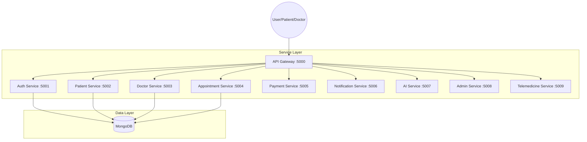

# TECHNICAL REPORT: AI-ENABLED SMART HEALTHCARE PLATFORM
## Group ID: SE-128 | Distributed Systems (SE3020)

---

## 1. High-Level Architectural Diagram
Our system follows a **Cloud-Native Microservices Architecture**. All communication is routed through a centralized **API Gateway** which handles cross-cutting concerns like security and routing.

---

## 2. Service Interfaces (API Endpoints)
Each service exposes a set of RESTful endpoints. Below are the primary interfaces:

### Auth Service
- `POST /register`: User registration
- `POST /login`: JWT authentication
- `GET /me`: Current user profile

### Appointment Service
- `POST /book`: Book an appointment (Patient)
- `GET /my-appointments`: List appointments (User Specific)
- `PUT /cancel/:id`: Cancel appointment
- `PUT /accept/:id`: Accept appointment (Doctor Only)

### Notification Service
- `POST /appointment-booked`: Trigger internal booking alerts
- `POST /send-email`: Dispatch SMTP notification
- `POST /send-sms`: Dispatch Twilio SMS notification

*(Detailed lists for all other 7 services are included in the Code Appendix)*

---

## 3. System Workflows
### Workflow: Telemedicine Consultation
1. **Booking**: Patient books an appointment via the `Appointment Service`.
2. **Acceptance**: Doctor reviews and accepts the appointment.
3. **Session Genesis**: Upon acceptance, the `Telemedicine Service` generates a transient Jitsi Video Room ID.
4. **Trigger**: The `Notification Service` pushes a real-time alert to the Patient's notification icon.
5. **Call**: Both parties join the video consultation via the secure Room ID.

---

## 4. Authentication & Security
- **Identity Provider**: Centralized `Auth Service` using **JWT (JSON Web Tokens)**.
- **Transport Security**: Token passed via `Authorization: Bearer <token>` headers.
- **RBAC (Role Based Access Control)**: 
    - **API Gateway** acts as the Policy Enforcement Point.
    - Specific middleware (`verifyToken`, `roleCheck`) ensures only authorized roles (e.g., `doctor` or `admin`) can access sensitive endpoints.
- **Data Integrity**: Passwords are multi-hashed using **Bcrypt** before storage.

---

## 5. Individual Contributions
- **W.M.R.M.Weerakoon (Member 1)**: Core Architecture, API Gateway, Auth Service, Admin Dashboard, and Frontend UI integration.
- **H.D.K.Ariyadasa (Member 2)**: Patient Service, Medical Report uploads (Multer), and patient-side profile logic.
- **V.S. Hettiarachchi (Member 3)**: Appointment Engine, Doctor Service, and Jitsi Telemedicine integration.
- **Manditha R.G.N (Member 4)**: Notification Service (SMS/Email), AI Symptom Checker, and Payment Gateway integration.
